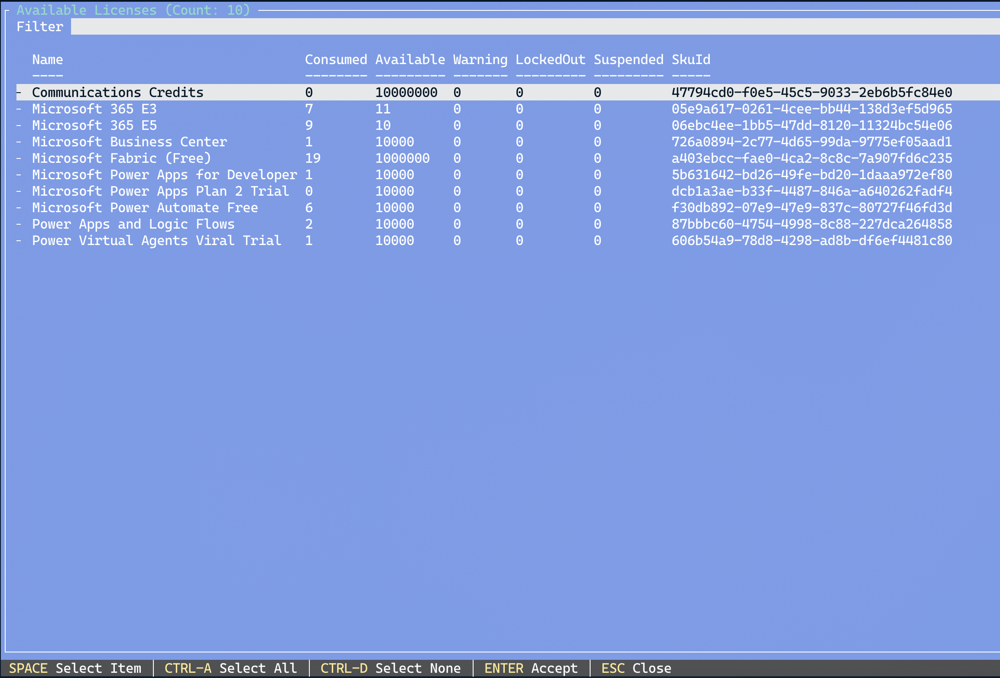
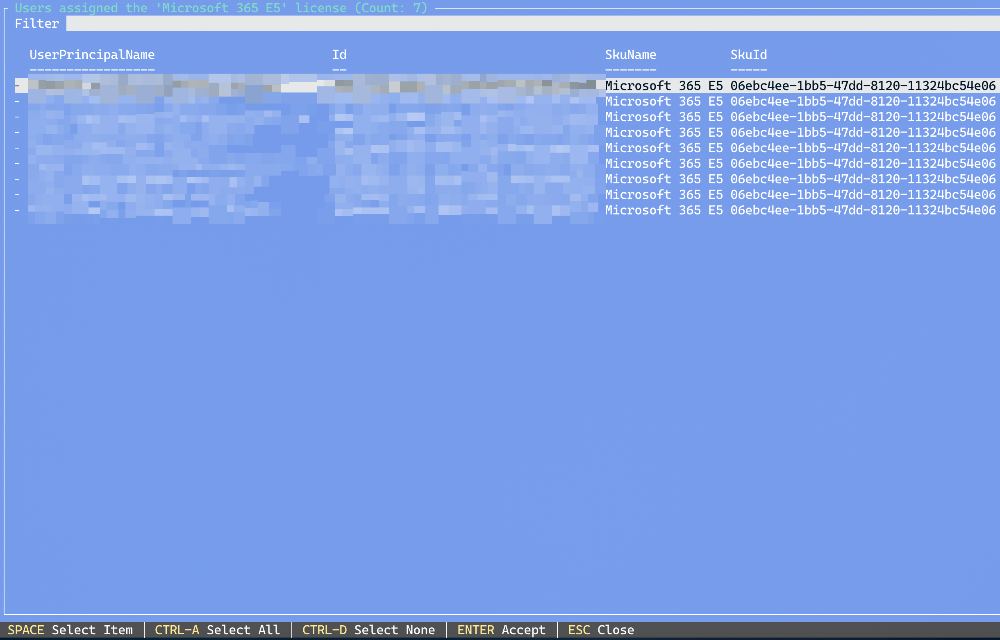
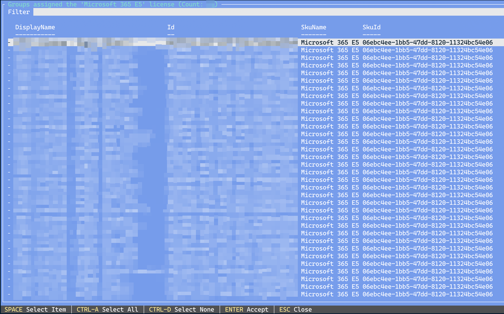
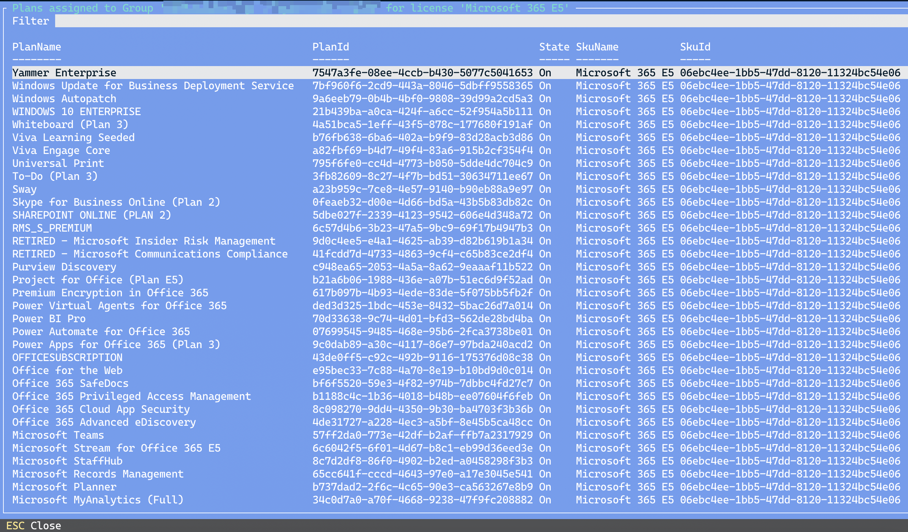
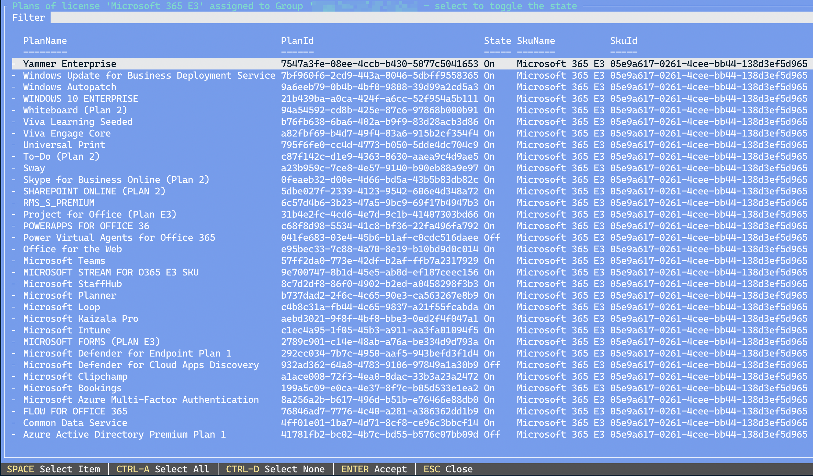
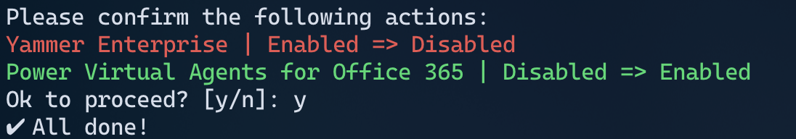
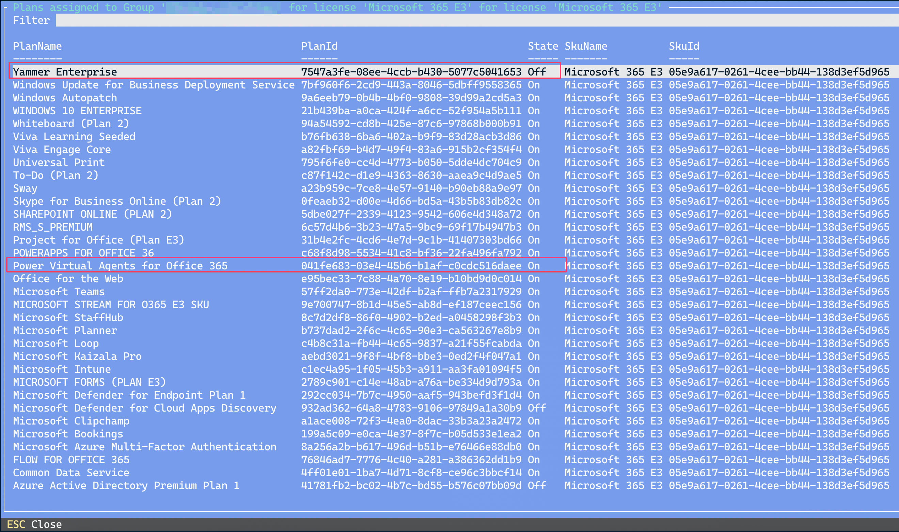

# Graph Licensing
Source code a module I created for managing Entra ID licensing via Graph. It isn't complete in any way. 

You can install the module [from PowerShell Gallery](https://www.powershellgallery.com/packages/Graph.Licensing/).

Tested on macOS, Linux, and Windows with PowerShell 7.4. Should work on other OSes too with PowerShell 7.x and above. 

## Pre-requisite modules
- "Microsoft.Graph.Authentication"
- "Microsoft.Graph.Groups"
- "Microsoft.Graph.Users"
- "Microsoft.Graph.Identity.DirectoryManagement"
- "Microsoft.PowerShell.ConsoleGuiTools"

## Screenshots

`Get-MgAvailableLicenses`

Selecting one or more of the licenses above (use `SPACE` key to make selections, followed by the `ENTER` key to confirm) will go through each of the selections and first show the users directly assigned to it. 

Followed by the groups directly assigned to it. 

In either screen (users or groups), selecting one or more entries (use `SPACE` key to make selections, followed by the `ENTER` key to confirm) will then go through each of the selections and show the plans. 

There are cmdlets to directly query a group or user rather than go the route above. 

It is also possible to modify the plan assignments. 

`Update-MgAssignedLicensePlans -UserPrincipalName $UPN -SkuName $SkuName` or `Update-MgAssignedLicensePlans -GroupName $GroupName -SkuName $SkuName`

After making the selections:

Confirm. Via `Get-MgAssignedLicenses -GroupName $GroupName -SkuName $SkuName` or `Get-MgAssignedLicenses -UserPrincipalName $UPN -SkuName $SkuName`

